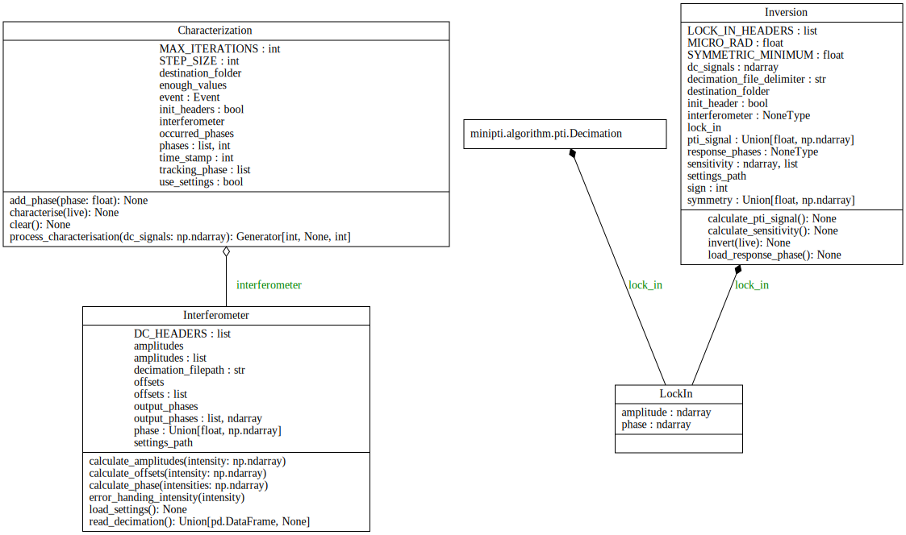

# MiniPTI

<p style="text-align: center;">

</p>

In this repository a GUI is provided to control the MiniPTI as also presented in [Waveguide based passively demodulated photothermal interferometer for light absorption measurements of trace substances](https://doi.org/10.1364/AO.476868). In addition to the GUI, Python implementations of the presented algorithms and the driver software for the MiniPTI hardware are also provided as libraries.

# 1. installation
The package can be installed via pip
pip install minipti

# 2. Usage and GUI
The GUI can be used via
```bash
python -m minipti.
```
<p style="text-align: center;">

</p>

# 3. libraries
## 3.1 Algorithm
The subpackage Algorithm contains the implementation of the algorithms and can be divided into the subpackages interferometry and pti. interferometry contains the algorithms for the interferometric phase and characterisation of the interferometer. pti contains the algorithms for decimation and PTI inversion.

It is also possible to use only the interferometer subpackage without having to install dependencies for the other packages.

<p style="text-align: center;">

</p>

### 3.1.1 Interferometry
interferometry contains the classes interferometer and characterisation.
Examples of usage can be found under <a href="https://github.com/bilaljo/MiniPTI/blob/main/examples/interferometry.py">examples/interferometer.py</a> and
<a href="https://github.com/bilaljo/MiniPTI/blob/main/examples/characterisation.py">examples/characterisation.py</a>.
### 3.1.2 PTI
pti contains the classes decimation inversion. Example calls can be found under <a href="https://github.com/bilaljo/MiniPTI/blob/main/examples/pti_inversion.py">examples/pti_inversion.py</a>
## 3.2 Hardware
Hardware contains the classes to control the motherboard (DAQ + BMS), laser (Probe and Pump Laser) and TEC driver as well as the valve control.
### 3.2.1 Serial Base Class
<p style="text-align: center;">

</p>
